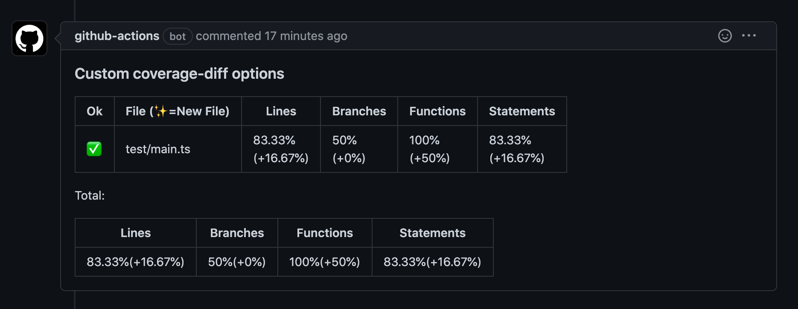

# simple-coverage-diff-action

GitHub Action to comment coverage diff to your PR using [coverage-diff](https://www.npmjs.com/package/coverage-diff).



## Usage

```yaml
name: Test with coverage diff

on:
  push:
    branches:
      - main
  pull_request: {}

jobs:
  test:
    name: Coverage Diff
    runs-on: ubuntu-latest

    steps:
      - uses: actions/checkout@v3
      - uses: actions/setup-node@v3
        with:
          node-version: 18
          cache: npm
      - run: npm ci
      - run: npx jest --coverage --reporters=json-summary

      - name: Coverage Diff
        uses: quramy/simple-coverage-diff-action@v1
        with:
          base-summary-json: coverage-summary.json
          head-summary-json: coverage/coverage-summary.json
          coverage-threshold: 80
          check-criteria: lines, branches
          update-if-exists: replace
          github-token: ${{ secrets.GITHUB_TOKEN }}
```

## Inputs

| Name                          | Required | Default                          | Description                                                                                         |
| :---------------------------- | :------- | :------------------------------- | :-------------------------------------------------------------------------------------------------- |
| `base-summary-json`           | YES      |                                  | File path to base json-summary file.                                                                |
| `head-summary-json`           |          | `coverage/coverage-summary.json` | File path to HEAD json-summary file.                                                                |
| `check-criteria`              |          |                                  | See [coverage-diff docs](https://flaviusone.github.io/coverage-diff/interfaces/ConfigOptions.html). |
| `coverage-threshold`          |          |                                  | See [coverage-diff docs](https://flaviusone.github.io/coverage-diff/interfaces/ConfigOptions.html). |
| `coverage-decrease-threshold` |          |                                  | See [coverage-diff docs](https://flaviusone.github.io/coverage-diff/interfaces/ConfigOptions.html). |
| `new-file-coverage-threshold` |          |                                  | See [coverage-diff docs](https://flaviusone.github.io/coverage-diff/interfaces/ConfigOptions.html). |
| `body-header`                 |          | `''`                             | Comment body header part.                                                                           |
| `body-footer`                 |          | `''`                             | Comment body footer part.                                                                           |
| `update-if-exists`            |          | `append`                         | If set, create or update a comment. This must be either `replace` or `append`                       |
| `github-token`                | YES      | `${{ github.token }}`            | GitHub token.                                                                                       |

## License

MIT
